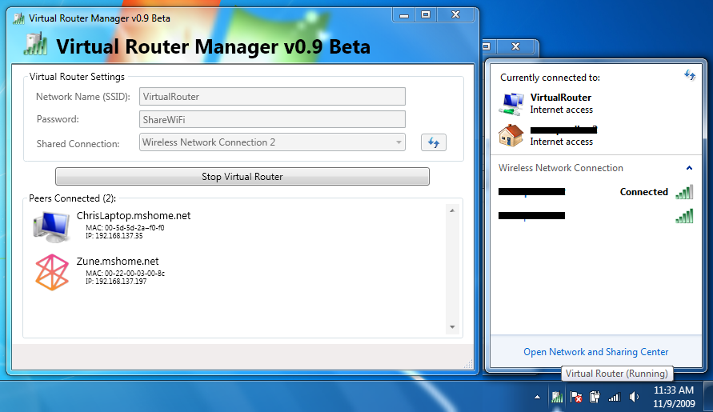

# Virtual Router

The original, opecn source Wifi Hotspot for Windows 7, Windows 8.x and Windows Server 2012 and newer!

_FYI, this project is no longer being updated. However, the software will still work as-is. If you find it helpful, please use it._

## What is Virtual Router?

Virtual Router is a free, open source software based router for PCs running Windows 8, Windows 7 or Windows Server 2008 R2. Using Virtual Router, users can wirelessly share any internet connection (Wifi, LAN, Cable Modem, Dial-up, Cellular, etc.) with any Wifi device (Laptop, Smart Phone, iPod Touch, iPhone, Android Phone, Zune, Netbook, wireless printer, etc.) These devices connect to Virtual Router just like any other access point, and the connection is completely secured using WPA2 (the most secure wireless encryption.)

_This application has had OVER 2 MILLION DOWNLOADS over the years. I am humbled and appreciative of being able to help so many people by adding a feature to Windows that Microsoft should have added themselves. Thanks you!_

## Download / Install

*Click below to download* the installer for Virtual Router v1.0 so you can get started using it today!

> **Important:** To install Virtual Router, you will also need to have [.NET Framework 3.5](https://www.microsoft.com/net/download/dotnet-framework/net35-sp1) installed on your Windows computer.

*For previous releases, you can find those located within the [`Release` folder](/Release) inside this repository.*

## Where can Virtual Router be used?

Anywhere you are!

Including:
- Home
- Office
- School
- Airport
- Bus Station
- The Park
- Grandmas House
- The In-Laws
- Absolutely Anywhere!

## No Advertising, No Hassle

Unlike similar applications, Virtual Router is not only completely Free, but will not annoy you with any advertisements. Also, since Virtual Router is not ad-supported, it does not track your web traffic the way other ad-supported applications do/can.

## Frequently Asked Questions (FAQ)

### Is Virtual Router Free to use?
Yes, Virtual Router is completely Free. If you've paid for it, then I suggest you demand a refund.

### Will I incur extra charges from my ISP using Virtual Router?

The bandwidth the extra devices you have connected to a Virtual Router shared Internet connection will of course count towards your internet service bandwidth. Using Virtual Router functions identically to using a router to share your internet connection. If you have questions regarding how much bandwidth you have allocated and/or what overage charges you may be subject to, then you should contact your Internet Service Provider.

### Which Wifi Devices are Supported?
The device support is dependent on you having a driver installed that is Certified for Windows 7 or Windows 8. As far as we know, part of the requirement for a wireless driver to be "Certified for Windows 7" or "Certified for Windows 8" must support the Virtual Wifi and Wireless Hosted Network features of Windows 7.  Unfortunately, in regards to using Virtual Router, any driver that is "Certified for Windows Vista" will work with your Wifi device in Windows 7 or 8, however it will not support the Virtual Wifi and Wireless Hosted Network features.

### Virtual Router will not start after installation
There are some cases that Virtual Router is unable to start immediately after installation. First you should make sure that you have the latest device drivers installed from the manufacturer of your Wifi device, then if that still doesn't work you should try restarting/rebooting you machine if you havn't already done so.

### Error: "group or resource is not in the correct state to perform the requested operation"

Here's a Hotfix available from Microsoft for a common cause of this problem on Windows 7 and Windows Server 2008 R2: <a href="http://support.microsoft.com/kb/2496820">http://support.microsoft.com/kb/2496820</a>  If the hotfix doesn't work, or you aren't using Windows 7 or 2008 R2, then you could try some of the suggestions at the following link: <a href="http://superuser.com/questions/373861/how-can-i-start-hostednetwork-on-windows-7">http://superuser.com/questions/373861/how-can-i-start-hostednetwork-on-windows-7</a>

### How do I know if my computer/hardware supports Virtual Router?

First, you need to have a Wifi device and driver that both support the Windows Virtual Wifi and Wireless Hosted Network features. Drivers that are Certified for Windows 7 or Windows 8 will work.

### Can I use Virtual Router with Windows Vista or Windows XP?</h2>
Unfortunately, Virtual Router will not work on Windows Vista or Windows XP, or any older version of Windows. Virtual Router is only compatible with Windows 7 and Windows 8 since the Virtual Wifi and Wireless Hosted Network features are new in Windows 7 and Windows Server 2008 R2.

### What About Windows 7 Starter Edition?

Unfortunately, Microsoft has disabled the Virtual Wifi features in Windows 7 Starter Edition so Virtual Router will not work. This is the only edition of Windows 7 that the software will not work with. 

### Is the connection encrypted? How secure it this?

The wireless connection is encrypted with [WPA2](http://en.wikipedia.org/wiki/Wi-Fi_Protected_Access) encryption. Encryption is also required, with no method of disabling it. The security of you "Virtual Router" is dependent on the strength of you Password / Passphrase.

### How To Change Device (Connected Peer) Icon

You can open the Device "Properties" dialog one of two ways:
1. Double Click the Device / Connected Peer
2. Right Click the Device / Connected Peer and Select "Properties..."
3. Then click on the "Change Icon..." Button, and Select the Icon you want and click "Save".

## Source Code

The source code for Virtual Router is located within the `Source` folder inside this repository.

This project was originally hosted on CodePlex, and an archive of that original project is located here: <http://virtualrouter.codeplex.com>

## Disclaimer

This software is provided "as-is" without any warranty express or implied.

## Project History

This software was originally created in 2009 using Virtual Wifi features that were newly introduced in the Windows 7 operating system. There were a couple improvements and releases made to the software with the most recent release in 2013. This software works well for what it does, and what it was intended for. However, at this time the project is no longer being updated. Please use this software for what it does and what value it offers you. Just because there aren't new updates doesn't negate the benefits from working software that still solves a need people have. If you need to share your laptop or desktops Internet connection with your smartphone, tablet, or other device then this software will likely help you. Plus, it doesn't advertise or spy on you like other similar solution. It's extremely humbling to see this software be so helpful to **MILLIONS of users** over the years. And, people still use this software today, over 10 years after the first release! Thank you, and you are more than welcome!!

> Feel free to use Virtual Router as-is. The latest realesed version still works just fine. However, this project will no longer be updated. I'm Chris Pietschmann, the creator of Virtual Router, and I truly thank the **MILLIONS of users** for using Virtual Router over the years! Feel free to keep using Virtual Router where it provides value.
